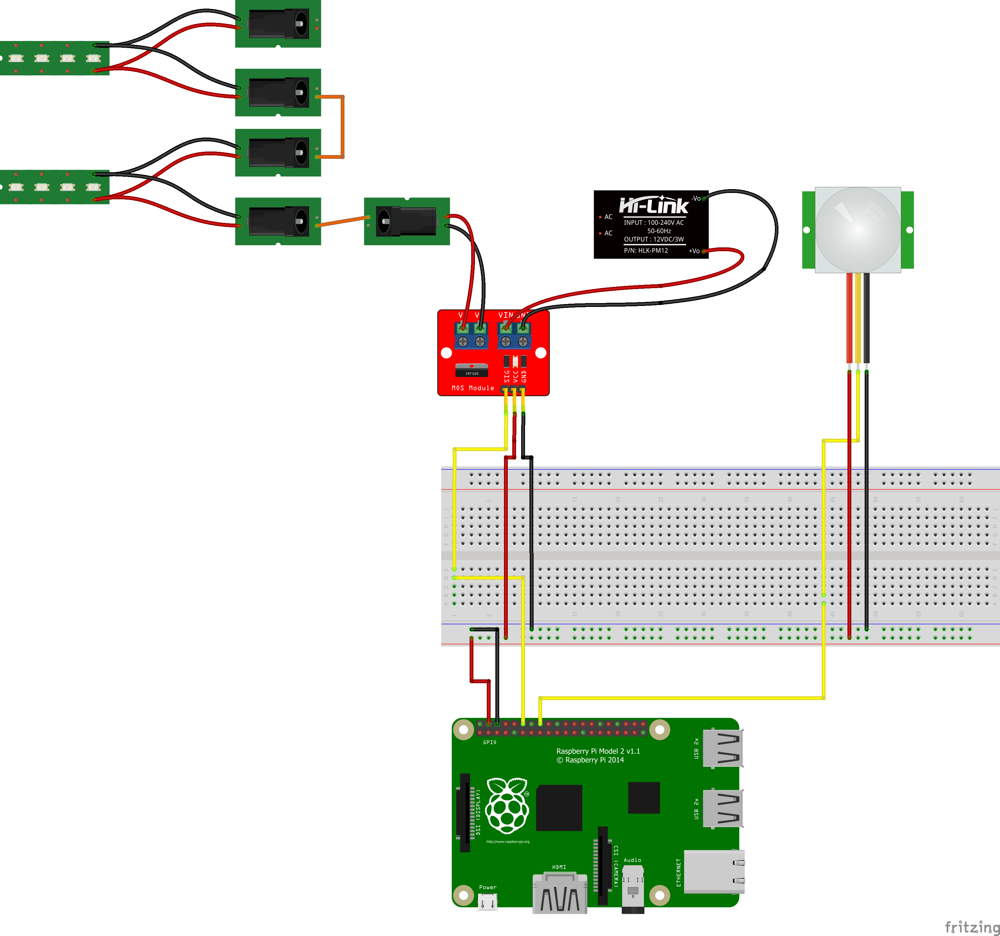

# Stairs lighting
A test project for my new stairs lighting, activated by PIR motion detectors from a Raspberry Pi using .NET Core.

Uses PWM to fade in LED strips on the stairs when going up or down them.

## Components

- Raspberry Pi 2 €30
- [HC-SR505 PIR motion sensor x2](https://www.aliexpress.com/item/HC-SR505-Mini-Infrared-PIR-Motion-Sensor-Precise-Infrared-Detector-Module/32696432618.html) €1.82
- [12v 1a transformer](https://www.aliexpress.com/item/12V-LED-Transformer-Power-Supply-Switch-Adapter-AC-110V-220V-TO-DC-12V-2A-3A-5A/32825039716.html) (Temporary, switching to a good quality 8A one for actual implementation) ~€32
- [IRF520 Mosfet integrated circuit](https://www.aliexpress.com/item/Top-Mosfet-Button-IRF520-Mosfet-Driver-Module-For-Arduino-MCU-ARM-For-Raspberry-Pi-3-3V/32869359376.html) €0.45
- [LED strip SMD 5050, warm white, non waterproof (7m total)](https://www.aliexpress.com/item/Hontiey-LED-Strip-SMD5050-or-2835-DC12V-60Leds-m-5m-roll-White-Blue-Green-Yellow-Red/32816736873.html) €10.34
- [LED diffuser x15](https://www.aliexpress.com/item/5pcs-20inch-0-5m-12mm-pcb-45-degree-corner-led-aluminium-profile-led-aluminum-channel-V/32836522522.html) €27.18
- [12v plugs pairs (M/F) x30 (6x 5 pairs)](https://www.aliexpress.com/item/10pcs-Male-Female-DC-Power-Jack-Plugs-Socket-Adapter-Connector-2-1mm-x-5-5mm-For/32875367406.html) €7.80
	- 2 female per strip (14 x 2 = 28)
	- 2 male between every strip + psu (14 x 2 = 28)
- Generic 240V cable + 12v wiring ~€15

Total cost: ~€130 - €150

## Wiring

